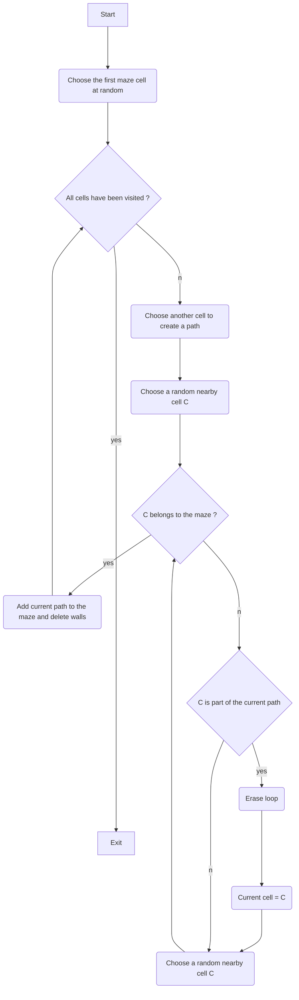

# Maze Generation

## Wilson's algorithm

> Wilson’s algorithm was developed by David Bruce Wilson, a principle
> researcher at Microsoft and an affiliate associate professor of
> mathematics at the University of Washington.

This algorithm performs  a [loop-erased random walk](https://en.wikipedia.org/wiki/Loop-erased_random_walk) , which means that as it goes, if the path it is forming happens to intersect with itself and form a loop, it erases that loop before continuing on.

Wilson's algorithm generates an unbiased sample from the [uniform distribution](https://en.wikipedia.org/wiki/Discrete_uniform_distribution) over all mazes.

### Flowchart

> Written with [StackEdit](https://stackedit.io/).
